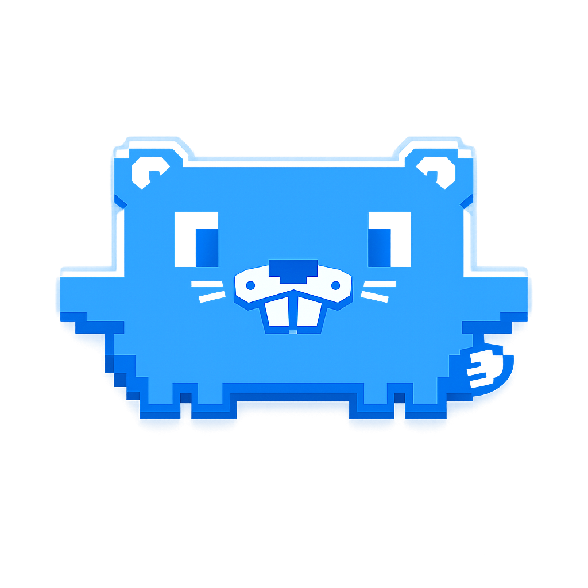
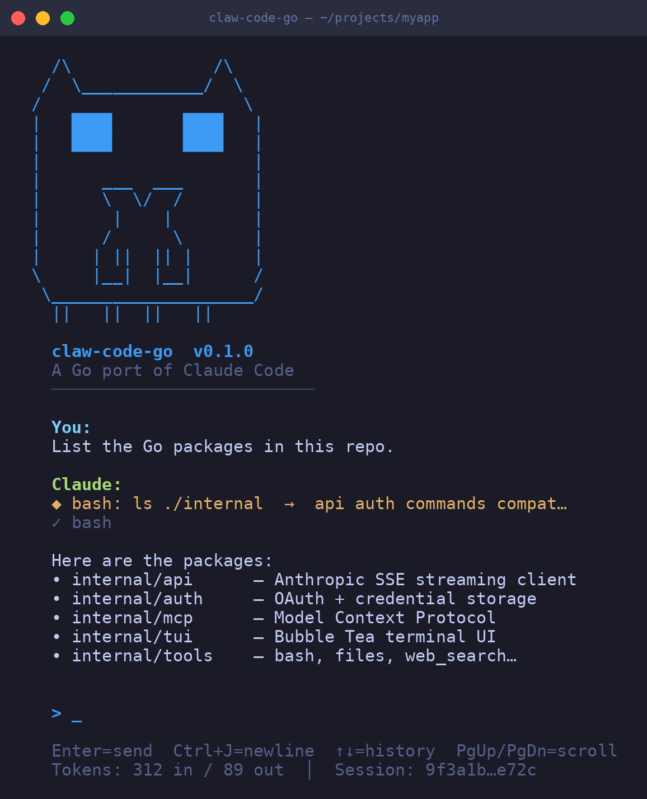

# claw-code-go

<p align="center">
  
</p>

<p align="center">
  <strong>A Go port of Claude Code — Anthropic's agentic CLI coding assistant</strong><br/>
  Fast. Extensible. Built for terminals.
</p>

<p align="center">
  
  
  
  
  
</p>

---

<p align="center">
  
</p>

---

## What is this?

`claw-code-go` is a full Go reimplementation of [Claude Code](https://docs.anthropic.com/en/docs/claude-code) — Anthropic's agentic coding assistant. It runs in your terminal, understands your codebase, calls tools, writes and edits files, searches the web, and works autonomously until the job is done.

**Why Go?**
- Single static binary — no Node.js runtime required
- Faster startup, lower memory footprint
- Easier to embed, cross-compile, and distribute

---

## Features

### 🤖 Agentic Loop
Full tool-use conversation loop: Claude reasons, calls tools, reads the results, and keeps going until the task is complete or it hits an `end_turn`.

### 🎨 Bubble Tea TUI
Rich terminal UI built with [Bubble Tea](https://github.com/charmbracelet/bubbletea) — streaming output with a spinner, styled message history, syntax-aware theming, and a clean session view.

### 🛠 Tool Suite

| Tool | Description |
|------|-------------|
| `bash` | Execute shell commands (30s timeout, sandboxed) |
| `read_file` | Read files from disk |
| `write_file` | Write/create files |
| `file_edit` | Surgical text replacements in existing files |
| `glob` | Find files matching a glob pattern |
| `grep` | Search across files with regex |
| `web_fetch` | Fetch and parse a URL |
| `web_search` | Search the web (Brave API) |
| `todo_write` | Track and persist task lists |

### 🔐 OAuth + Multi-Provider Auth
Native OAuth flow for Anthropic accounts. Credentials are stored securely and refreshed automatically. OpenAI is scaffolded alongside Anthropic — swap providers via config.

### 🌐 MCP — Model Context Protocol
Full MCP integration: connect external tool servers over stdio or SSE, register their tools, and let Claude call them seamlessly alongside built-in tools.

### 🔒 Permissions & Safety
Fine-grained permission system controls what Claude can do — bash execution, file writes, network access — with configurable modes (`auto`, `ask`, `deny`) and rule-based overrides.

### 📦 Context Assembly
On every turn, claw-code-go automatically injects:
- Git repo state (branch, diff summary, recent commits)
- Memory directory files (`.claw-code/memory/`)
- System info (OS, hostname, working directory)

### 💾 Session Persistence & History
Sessions are saved as JSON files in `~/.claw-code/sessions/`. Resume any previous session by ID. The TUI includes a built-in session history browser.

### 📊 Token Usage & Cost Tracking
Every session tracks input/output tokens per turn. Estimated USD cost is shown at the end of each session for all known models (Claude 3/4 + GPT-4o family).

### ⚡ Context Compaction
Automatic conversation compaction keeps context windows manageable on long sessions — summarising older turns without losing important state.

### 🧠 Memory Directory
Drop markdown files into `.claw-code/memory/` and they're injected into every conversation automatically — persistent instructions, project context, preferences.

---

## Prerequisites

- **Go 1.24+**
- `ANTHROPIC_API_KEY` environment variable (or log in via `--login`)

---

## Install

```sh
git clone https://github.com/daolmedo/claw-code-go
cd claw-code-go
go build -o claw-code-go ./cmd/claw-code-go
```

Or install directly:

```sh
go install github.com/daolmedo/claw-code-go/cmd/claw-code-go@latest
```

---

## Usage

### Interactive REPL (default)

```sh
./claw-code-go
```

### One-shot mode

```sh
export ANTHROPIC_API_KEY=sk-ant-...
./claw-code-go --prompt "Refactor the auth package to use interfaces"
```

### Login — Anthropic (OAuth)

```sh
./claw-code-go --login
# or explicitly:
./claw-code-go --login --provider anthropic
```

### Login — OpenAI (API key)

```sh
./claw-code-go --login --provider openai
# Prompts for your OpenAI API key and stores it securely
```

Credentials are saved to `~/.claw-code/credentials/` and reused automatically on the next run. Switch providers at any time with `--provider`.

### Resume a session

```sh
./claw-code-go --session <session-id>
```

---

## CLI Flags

| Flag | Default | Description |
|------|---------|-------------|
| `--prompt` | — | Single prompt (one-shot mode) |
| `--model` | `claude-sonnet-4-20250514` | Model to use |
| `--provider` | `anthropic` | AI provider: `anthropic`, `openai` |
| `--repl` | false | Force interactive REPL mode |
| `--login` | false | Authenticate for the selected provider |
| `--session` | — | Resume a saved session by ID |
| `--session-dir` | `~/.claw-code/sessions` | Directory for session files |
| `--permission-mode` | `ask` | Permission mode: `auto`, `ask`, `deny` |

---

## Slash Commands (REPL)

| Command | Description |
|---------|-------------|
| `/help` | Show available commands |
| `/clear` | Clear the current session |
| `/session-list` | Browse saved sessions |
| `/model <name>` | Switch model mid-session |
| `/compact` | Manually trigger context compaction |
| `/cost` | Show current session token usage and estimated cost |
| `/exit` or `/quit` | Exit the REPL |

---

## Environment Variables

| Variable | Description |
|----------|-------------|
| `ANTHROPIC_API_KEY` | Your Anthropic API key |
| `ANTHROPIC_MODEL` | Override the default model |
| `ANTHROPIC_BASE_URL` | Override the Anthropic API base URL |
| `OPENAI_API_KEY` | OpenAI API key (if using OpenAI provider) |

---

## Project Structure

```
claw-code-go/
├── cmd/claw-code-go/        # CLI entry point
└── internal/
    ├── api/                 # Anthropic API client (SSE streaming, types)
    ├── auth/                # OAuth flow, credential storage, token refresh
    ├── commands/            # Slash command registry
    ├── compat/              # Upstream TS source parity manifest
    ├── config/              # Config loading, permission modes, rules
    ├── context/             # Context assembly (git, memory, sysinfo)
    ├── mcp/                 # Model Context Protocol client (stdio + SSE)
    ├── permissions/         # Permission enforcement & rule engine
    ├── runtime/             # Agentic conversation loop, session persistence
    ├── tools/               # Built-in tool implementations
    ├── tui/                 # Bubble Tea TUI (model, styles, theme, history)
    └── usage/               # Token tracking and cost estimation
```

---

## Roadmap

- [x] Phase 1 — Foundation: API client, basic conversation loop, core tools
- [x] Phase 2 — TUI: Bubble Tea UI, streaming, spinner, slash commands
- [x] Phase 3 — OAuth + multi-provider scaffolding
- [x] Phase 4 — MCP (Model Context Protocol) integration
- [x] Phase 5 — Permissions & Safety
- [x] Phase 6 — Context compaction
- [x] Phase 7 — Multi-provider login UX
- [x] Phase 8 — Compat harness modes
- [x] Phase 9 — Full TUI foundation (themes, history view)
- [x] Phase 10 — Core tool expansion (file_edit, web_fetch, web_search, todo_write)
- [x] Phase 11 — Permissions + config system
- [x] Phase 12 — Context assembly + memory directory
- [x] Phase 13 — Cost tracking + session history UI
- [ ] Phase 14 — LSP integration
- [ ] Phase 15 — Plugin/extension system

---

## Contributing

PRs welcome. Run `go build ./...` and `go vet ./...` before submitting.

---

## License

MIT
